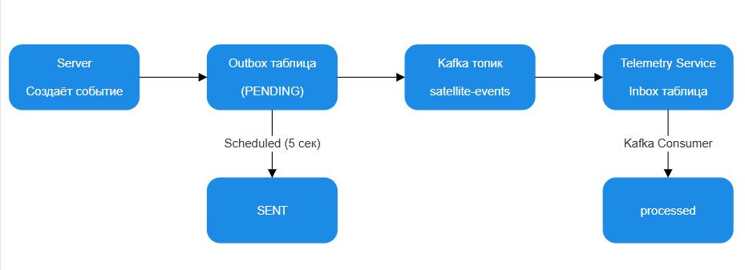
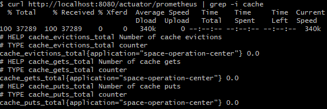
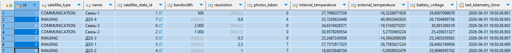
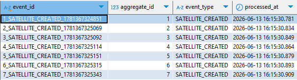
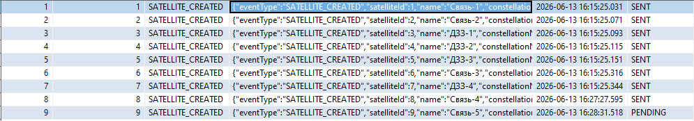
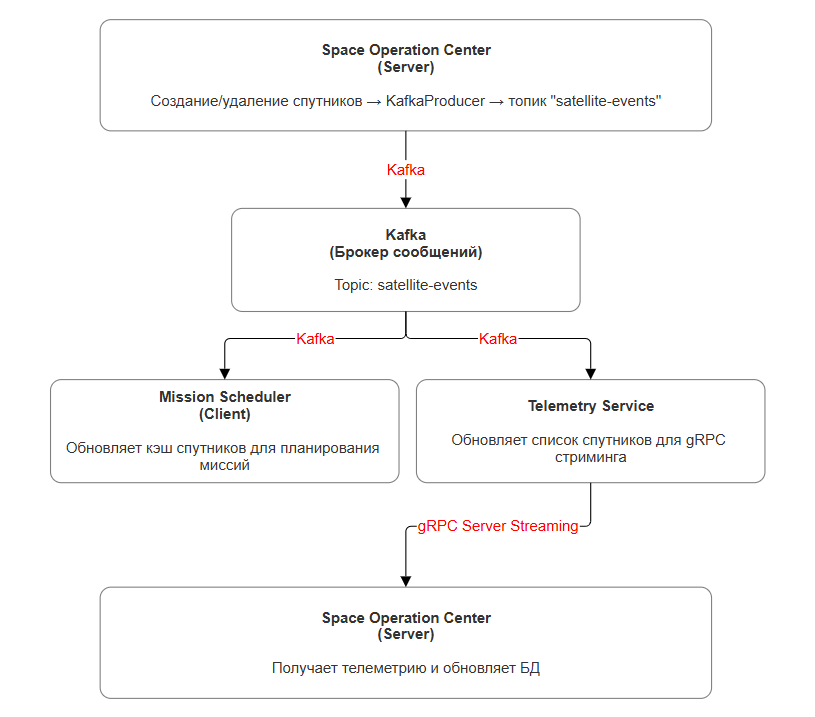

# 🛰️ Система управления спутниковыми группировками

## Общее описание

Система состоит из **трёх** независимых микросервисов:

1. **Space Operation Center (Server)** — основной сервис управления спутниками
2. **Mission Scheduler (Client)** — сервис-планировщик для автоматического выполнения миссий
3. **Telemetry Service** — сервис телеметрии (gRPC Server Streaming)

**Основные возможности:**
- Постоянное хранение данных в **PostgreSQL** с логическим разделением схем
- Миграции через **Flyway** для каждого сервиса
- **gRPC Server Streaming** для непрерывной передачи телеметрии спутников
- **Apache Kafka** для асинхронного обмена событиями о спутниках
- **Outbox / Inbox паттерн** для гарантированной доставки событий
- **Kafka UI** для мониторинга топиков и сообщений
- Управление демо-данными через флаг `app.demo.enabled`
- Кэширование данных **Redis**

---

## Запуск системы в контейнере

### Требования

- Установленный **Docker** (версия 20.10+)
- Установленный **Docker Compose** (версия 2.0+)
- Свободные порты:

| Порт | Сервис |
|------|--------|
| 8080 | Server (REST API) |
| 8081 | Mission Scheduler |
| 8082 | Kafka UI |
| 5432 | PostgreSQL |
| 9091 | gRPC (Telemetry Service) |
| 9092 | Kafka Broker |
| 6379 | Redis |

---

## Структура проекта

```
project-root/
├── Server/                         # Основной сервис управления спутниками
│   ├── src/
│   ├── build.gradle.kts
│   └── Dockerfile
├── Client/                         # Планировщик миссий
│   ├── src/
│   ├── build.gradle.kts
│   └── Dockerfile
├── TelemetryService/               # Сервис телеметрии (gRPC)
│   ├── src/
│   ├── build.gradle.kts
│   └── Dockerfile
├── docker-compose.yml
└── init-schemas.sql                # Создание схем БД
```

---

## Схема базы данных

Система использует **логическое разделение схем** в PostgreSQL:

| Схема | Владелец | Таблицы | Назначение |
|-------|----------|---------|------------|
| `server_schema` | Server | `constellations`, `satellites`, `energy_systems`, `satellite_states`, `outbox` | Основные бизнес-сущности и outbox паттерн |
| `telemetry_schema` | Telemetry Service | `inbox` | Хранение обработанных событий о создании спутников |

### Создание схем

При первом запуске PostgreSQL автоматически создаёт схемы через `init-schemas.sql`:

```sql
CREATE SCHEMA IF NOT EXISTS server_schema;
CREATE SCHEMA IF NOT EXISTS telemetry_schema;
GRANT ALL ON SCHEMA server_schema TO postgres;
GRANT ALL ON SCHEMA telemetry_schema TO postgres;
ALTER ROLE postgres SET search_path TO server_schema, telemetry_schema, public;
```

### Миграции

- **Server** управляет своей схемой через Flyway (миграции V1-V4)
- **Telemetry Service** управляет своей схемой через Flyway (миграция V1)

---

## Outbox / Inbox паттерн

Для гарантированной доставки событий между микросервисами используется **Outbox/Inbox паттерн** с Kafka.

### Архитектура



### Компоненты

| Компонент | Описание | Период |
|-----------|----------|--------|
| `OutboxScheduler` | Планировщик, отправляющий события из outbox в Kafka | 5 секунд |
| `satellite-events` | Kafka топик для событий о спутниках | - |
| `Inbox` | Таблица в telemetry_schema для исключения дубликатов | - |

### Миграции

**Server (V3__create_outbox_table.sql):**
```sql
CREATE TABLE IF NOT EXISTS outbox (
    id BIGSERIAL PRIMARY KEY,
    aggregate_id BIGINT NOT NULL,
    event_type VARCHAR(50) NOT NULL,
    payload TEXT NOT NULL,
    created_at TIMESTAMP NOT NULL DEFAULT CURRENT_TIMESTAMP,
    status VARCHAR(20) NOT NULL DEFAULT 'PENDING'
);
```

**Telemetry Service (V1__create_inbox_table.sql):**
```sql
CREATE TABLE IF NOT EXISTS inbox (
    event_id VARCHAR(255) PRIMARY KEY,
    aggregate_id BIGINT NOT NULL,
    event_type VARCHAR(50) NOT NULL,
    processed_at TIMESTAMP NOT NULL DEFAULT CURRENT_TIMESTAMP
);
```

---

## Уникальные ограничения (V4 миграция)

Для защиты от дублирования данных добавлены уникальные ограничения:

```sql
ALTER TABLE satellites ADD CONSTRAINT unique_satellite_name UNIQUE (name);
ALTER TABLE constellations ADD CONSTRAINT unique_constellation_name UNIQUE (name);
```

Перед добавлением ограничений миграция удаляет существующие дубликаты.

---

## Кэширование через Redis

Для ускорения чтения данных и снижения нагрузки на базу данных внедрено кэширование через **Redis** с использованием **Spring Cache Abstraction**.

### Настройка

**Зависимости (build.gradle.kts):**
```kotlin
implementation("org.springframework.boot:spring-boot-starter-cache")
implementation("org.springframework.boot:spring-boot-starter-data-redis")
implementation("io.lettuce:lettuce-core")
implementation("io.micrometer:micrometer-core")
implementation("io.micrometer:micrometer-registry-prometheus")
```

**Конфигурация (application.yml):**
```yaml
spring:
  cache:
    type: redis
    redis:
      time-to-live: 600000 # 10 минут
      cache-null-values: false
      key-prefix: "space:"
      use-key-prefix: true

  data:
    redis:
      host: ${REDIS_HOST:localhost}
      port: ${REDIS_PORT:6379}
      timeout: 5000ms
      connect-timeout: 3000ms
      fail-on-connection: false # Graceful degradation
      client-type: lettuce
      lettuce:
        pool:
          max-active: 8
          max-idle: 8
          min-idle: 0
          max-wait: -1ms
```

### Кэшируемые методы

| Метод | Кэш | Ключ | TTL | Описание |
|-------|-----|------|-----|----------|
| `getSatelliteById(Long id)` | `satellite` | `#id` | 10 мин | Данные спутника |
| `getConstellation(String name)` | `constellation` | `#name` | 15 мин | Информация о группировке |
| `getAllSatellites()` | `satellitesAll` | `'all'` | 5 мин | Список всех спутников |
| `getCachedAllConstellationsStatus()` | `constellationsAll` | `'all'` | 5 мин | Статус всех группировок |
| `getCachedConstellationStatus()` | `constellationStatus` | `#constellationName` | 15 мин | Статус группировки |

### Примеры аннотаций

**Кэширование чтения:**
```java
@Cacheable(value = "satellite", key = "#id")
public Optional<SatelliteEntity> getSatelliteById(Long id) { ... }

@Cacheable(value = "satellitesAll", key = "'all'")
public List<SatelliteEntity> getAllSatellites() { ... }
```

**Кастомный ключ:**
```java
@Cacheable(value = "satellite", key = "#constellationName + '::' + #satelliteName")
public Optional<SatelliteEntity> findByName(String constellationName, String satelliteName) { ... }
```

**Инвалидация кэша:**
```java
@CacheEvict(value = "satellitesAll", allEntries = true)
public SatelliteEntity createSatellite(SatelliteParam param) { ... }

@CacheEvict(value = {"satellite", "satellitesAll"}, allEntries = true)
public void deleteSatellite(Long id) { ... }
```

### Инвалидация кэша

| Действие | Очищаемые кэши |
|----------|----------------|
| Создание спутника | `satellitesAll` |
| Обновление спутника | `satellite::{id}` |
| Удаление спутника | `satellite::{id}`, `satellitesAll` |
| Изменение состава группировки | `constellation::{name}`, `satellitesAll`, `constellationsAll`, `constellationStatus` |
| Создание группировки | `constellationsAll`, `constellationStatus`, `satellitesAll` |

### Graceful degradation

При недоступности Redis система автоматически переключается на **in-memory кэш**:

```java
@Bean
@Primary
public CacheManager cacheManager(RedisConnectionFactory redisConnectionFactory) {
    try {
        return RedisCacheManager.builder(redisConnectionFactory)
                .cacheDefaults(defaultConfig)
                .build();
    } catch (Exception e) {
        return new ConcurrentMapCacheManager();
    }
}
```

### Проверка работы

```bash
# Первый запрос — данные из БД
curl http://localhost:8080/api/constellations/status

# Проверить Redis
docker exec -it redis redis-cli KEYS "*"
docker exec -it redis redis-cli TTL "constellationsAll::all"

# Второй запрос — данные из кэша
curl http://localhost:8080/api/constellations/status

# Проверить, что запрос не пошёл в БД
docker-compose logs server | grep "ЗАПРОС В БД" | tail -5
```

### Мониторинг метрик

```bash
# Метрики кэша
curl http://localhost:8080/actuator/metrics/cache.gets
curl http://localhost:8080/actuator/metrics/cache.puts

# Метрики в формате Prometheus
curl http://localhost:8080/actuator/prometheus | grep -i cache
```



**Конфигурация Actuator:**
```yaml
management:
  endpoints:
    web:
      exposure:
        include: health,info,metrics,cache,prometheus
  endpoint:
    cache:
      enabled: true
  metrics:
    enable:
      cache: true
```

---

## gRPC Server Streaming

Telemetry Service использует **gRPC Server Streaming** для непрерывной передачи телеметрии.

### Серверная часть (TelemetryGrpcService)

```java
@GrpcService
public class TelemetryGrpcService extends TelemetryServiceGrpc.TelemetryServiceImplBase {
    
    private static final long UPDATE_INTERVAL_SECONDS = 2;
    
    @Override
    public void streamTelemetry(TelemetryRequest request, 
                                StreamObserver<TelemetryUpdate> responseObserver) {
        scheduler.scheduleAtFixedRate(() -> {
            for (SatelliteEvent satellite : satelliteCacheService.getAllSatellites().values()) {
                TelemetryUpdate update = generateTelemetryUpdate(satellite.getName());
                responseObserver.onNext(update);
            }
        }, 0, UPDATE_INTERVAL_SECONDS, TimeUnit.SECONDS);
    }
}
```

### Клиентская часть (TelemetryUpdateService)

```java
@Service
public class TelemetryUpdateService {
    
    @GrpcClient("telemetry-service")
    private TelemetryServiceGrpc.TelemetryServiceStub telemetryStub;
    
    @Async("telemetryExecutor")
    @Transactional
    public void updateSatelliteTelemetry(TelemetryUpdate update) {
        // Обновление БД с активной транзакцией
    }
}
```

### Асинхронная обработка

```java
@Configuration
@EnableAsync
public class AsyncConfig {
    @Bean(name = "telemetryExecutor")
    public Executor telemetryExecutor() {
        ThreadPoolTaskExecutor executor = new ThreadPoolTaskExecutor();
        executor.setCorePoolSize(2);
        executor.setMaxPoolSize(4);
        return executor;
    }
}
```

---

## Файлы для запуска

### 1. Dockerfile для Server (`Server/Dockerfile`)

```dockerfile
# Build stage
FROM gradle:8.5-jdk21 AS build
WORKDIR /app
COPY build.gradle.kts settings.gradle.kts ./
COPY src ./src
RUN gradle clean build -x test --no-daemon

# Run stage
FROM eclipse-temurin:21-jre-alpine
RUN apk add --no-cache curl
WORKDIR /app
RUN addgroup -g 1000 -S appgroup && adduser -u 1000 -S appuser -G appgroup
COPY --from=build /app/build/libs/SatelliteApp-1.0-SNAPSHOT.jar app.jar
USER appuser
EXPOSE 8080
ENTRYPOINT ["java", "-jar", "app.jar"]
```

### 2. Dockerfile для Client (`Client/Dockerfile`)

```dockerfile
# Build stage
FROM gradle:8.5-jdk21 AS build
WORKDIR /app
COPY build.gradle.kts settings.gradle.kts ./
COPY src ./src
RUN gradle clean build -x test --no-daemon

# Run stage
FROM eclipse-temurin:21-jre-alpine
WORKDIR /app
RUN addgroup -g 1000 -S appgroup && adduser -u 1000 -S appuser -G appgroup
COPY --from=build /app/build/libs/SatelliteApp-1.0-SNAPSHOT.jar app.jar
USER appuser
EXPOSE 8081
ENTRYPOINT ["java", "-jar", "app.jar"]
```

### 3. Dockerfile для TelemetryService (`TelemetryService/Dockerfile`)

```dockerfile
# Build stage
FROM gradle:8.5-jdk21 AS build
WORKDIR /app
COPY build.gradle.kts settings.gradle.kts ./
COPY src ./src
RUN gradle clean build -x test --no-daemon

# Run stage
FROM eclipse-temurin:21-jre-alpine
RUN apk add --no-cache curl
WORKDIR /app
RUN addgroup -g 1000 -S appgroup && adduser -u 1000 -S appuser -G appgroup
COPY --from=build /app/build/libs/TelemetryService-1.0-SNAPSHOT.jar app.jar
USER appuser
EXPOSE 9090 9091
ENTRYPOINT ["java", "-jar", "app.jar"]
```

### 4. docker-compose.yml

```yaml
services:
  # ========== PostgreSQL ==========
  postgres:
    image: postgres:16-alpine
    container_name: postgres_db
    restart: unless-stopped
    environment:
      POSTGRES_DB: satellite_db
      POSTGRES_USER: postgres
      POSTGRES_PASSWORD: postgres
      # Создаём схемы при старте
      POSTGRES_INITDB_ARGS: "--auth-host=scram-sha-256"
    ports:
      - "5432:5432"
    volumes:
      - postgres_data:/var/lib/postgresql/data
      - ./init-schemas.sql:/docker-entrypoint-initdb.d/init-schemas.sql
    healthcheck:
      test: ["CMD-SHELL", "pg_isready -U postgres"]
      interval: 10s
      timeout: 5s
      retries: 5
    networks:
      - space-network

  # ========== Redis ==========
  redis:
    image: redis:7.4-alpine
    container_name: redis
    restart: unless-stopped
    ports:
      - "6379:6379"
    healthcheck:
      test: ["CMD", "redis-cli", "ping"]
      interval: 10s
      timeout: 5s
      retries: 5
    networks:
      - space-network

  # ========== Kafka ==========
  kafka:
    image: apache/kafka:3.7.0
    container_name: kafka
    restart: unless-stopped
    environment:
      KAFKA_NODE_ID: 1
      KAFKA_PROCESS_ROLES: broker,controller
      KAFKA_CONTROLLER_QUORUM_VOTERS: 1@kafka:9093
      KAFKA_LISTENERS: PLAINTEXT://0.0.0.0:9092,CONTROLLER://0.0.0.0:9093
      KAFKA_ADVERTISED_LISTENERS: PLAINTEXT://kafka:9092
      KAFKA_LISTENER_SECURITY_PROTOCOL_MAP: PLAINTEXT:PLAINTEXT,CONTROLLER:PLAINTEXT
      KAFKA_CONTROLLER_LISTENER_NAMES: CONTROLLER
      KAFKA_LOG_DIRS: /tmp/kraft-combined-logs
      KAFKA_AUTO_CREATE_TOPICS_ENABLE: "true"
      KAFKA_OFFSETS_TOPIC_REPLICATION_FACTOR: 1
      KAFKA_TRANSACTION_STATE_LOG_REPLICATION_FACTOR: 1
      KAFKA_TRANSACTION_STATE_LOG_MIN_ISR: 1
    ports:
      - "9092:9092"
    healthcheck:
      test: ["CMD-SHELL", "/opt/kafka/bin/kafka-topics.sh --bootstrap-server localhost:9092 --list || exit 1"]
      interval: 15s
      timeout: 10s
      retries: 10
      start_period: 30s
    networks:
      - space-network

  # ========== Kafka UI ==========
  kafka-ui:
    image: provectuslabs/kafka-ui:latest
    container_name: kafka-ui
    restart: unless-stopped
    depends_on:
      kafka:
        condition: service_healthy
    ports:
      - "8082:8080"
    environment:
      KAFKA_CLUSTERS_0_NAME: local
      KAFKA_CLUSTERS_0_BOOTSTRAPSERVERS: kafka:9092
      KAFKA_CLUSTERS_0_READONLY: "false"
    networks:
      - space-network

  # ========== Telemetry Service ==========
  telemetry-service:
    build: ./TelemetryService
    container_name: telemetry-service
    restart: unless-stopped
    depends_on:
      postgres:
        condition: service_healthy
      kafka:
        condition: service_healthy
    environment:
      - SERVER_PORT=9090
      - GRPC_SERVER_PORT=9091
      - KAFKA_BOOTSTRAP_SERVERS=kafka:9092
      - DB_URL=jdbc:postgresql://postgres:5432/satellite_db?currentSchema=telemetry_schema
      - DB_USERNAME=postgres
      - DB_PASSWORD=postgres
      - SPRING_JPA_HIBERNATE_DDL_AUTO=validate
      - SPRING_FLYWAY_ENABLED=true
      - SPRING_FLYWAY_SCHEMAS=telemetry_schema
      - SPRING_FLYWAY_BASELINE_ON_MIGRATE=true
    ports:
      - "9091:9091"
    healthcheck:
      test: ["CMD", "curl", "-f", "http://localhost:9090/actuator/health"]
      interval: 10s
      timeout: 5s
      retries: 10
      start_period: 45s
    networks:
      - space-network

  # ========== Server ==========
  server:
    build: ./Server
    container_name: server
    restart: unless-stopped
    depends_on:
      postgres:
        condition: service_healthy
      kafka:
        condition: service_healthy
      telemetry-service:
        condition: service_healthy
      redis:
        condition: service_healthy
    environment:
      - SERVER_PORT=8080
      - DB_URL=jdbc:postgresql://postgres:5432/satellite_db?currentSchema=server_schema
      - DB_USERNAME=postgres
      - DB_PASSWORD=postgres
      - JPA_SHOW_SQL=false
      - KAFKA_BOOTSTRAP_SERVERS=kafka:9092
      - GRPC_CLIENT_TELEMETRY_SERVICE_ADDRESS=static://telemetry-service:9091
      - GRPC_CLIENT_TELEMETRY_SERVICE_NEGOTIATION_TYPE=plaintext
      - SPRING_FLYWAY_ENABLED=true
      - SPRING_FLYWAY_SCHEMAS=server_schema
      - SPRING_FLYWAY_BASELINE_ON_MIGRATE=true
      - MANAGEMENT_HEALTH_GRPC_ENABLED=false
      - REDIS_HOST=redis
      - REDIS_PORT=6379
      - SPRING_CACHE_REDIS_TIME_TO_LIVE=600000
    ports:
      - "8080:8080"
    healthcheck:
      test: ["CMD", "curl", "-f", "http://localhost:8080/actuator/health"]
      interval: 10s
      timeout: 5s
      retries: 10
      start_period: 60s
    networks:
      - space-network

  # ========== Mission Service ==========
  mission-service:
    build: ./Client
    container_name: mission-service
    restart: unless-stopped
    depends_on:
      server:
        condition: service_healthy
      kafka:
        condition: service_healthy
    environment:
      - SERVER_PORT=8081
      - APP_SPACE_CENTER_SERVICE_URL=http://server:8080/api
      - KAFKA_BOOTSTRAP_SERVERS=kafka:9092
    ports:
      - "8081:8081"
    healthcheck:
      test: ["CMD", "curl", "-f", "http://localhost:8081/actuator/health"]
      interval: 10s
      timeout: 5s
      retries: 10
      start_period: 30s
    networks:
      - space-network

networks:
  space-network:
    driver: bridge

volumes:
  postgres_data:
```

---

## Запуск системы

### Шаг 1: Открыть терминал в корне проекта

```bash
cd SatelliteApp12
```

### Шаг 2: Собрать и запустить контейнеры

```bash
docker-compose up --build
```

**Что произойдёт:**
1. Запустится PostgreSQL (ждём healthcheck) → создаст схемы `server_schema`, `telemetry_schema`
2. Запустится Redis
3. Запустится Kafka (ждём healthcheck)
4. Запустится Kafka UI
5. Запустится Telemetry Service (создаст таблицу `inbox`)
6. Запустится Server (миграции V1-V4, создание таблиц и outbox)
7. Запустится Mission Service (ждёт Server и Kafka)

### Шаг 3: Фоновый запуск

```bash
# Запуск в фоне
docker-compose up --build -d

# Просмотр логов
docker-compose logs -f

# Просмотр логов конкретного сервиса
docker-compose logs -f server
docker-compose logs -f mission-service
docker-compose logs -f telemetry-service
```

---

## Проверка работоспособности

### 1. Проверка Server

```bash
# Health check
curl http://localhost:8080/actuator/health

# Swagger UI
http://localhost:8080/swagger-ui.html

# Статус всех группировок
curl http://localhost:8080/api/constellations/status
```

### 2. Проверка Mission Service

```bash
# Health check
curl http://localhost:8081/api/scheduler/health

# Список миссий
curl http://localhost:8081/api/scheduler/missions

# Статистика
curl http://localhost:8081/api/scheduler/stats

# Ручной запуск миссии для группировки
curl -X POST "http://localhost:8081/api/scheduler/missions/constellation/Орбита-1/run"
```

### 3. Проверка Telemetry Service

```bash
# REST health check
curl http://localhost:9090/actuator/health

# Проверить gRPC сервер
docker logs telemetry-service | grep "gRPC Server started"
```

### 4. Проверка Kafka UI

Открыть в браузере: `http://localhost:8082`

- Просмотр топиков
- Мониторинг сообщений в `satellite-events`
- Просмотр consumer групп

### 5. Проверка PostgreSQL

```bash
# Подключиться к БД
docker exec -it postgres_db psql -U postgres -d satellite_db

# Показать все группировки из server_schema
SELECT * FROM server_schema.constellations;

# Показать все спутники с телеметрией
SELECT name, internal_temperature, external_temperature, battery_voltage, last_telemetry_time 
FROM server_schema.satellites;

# Показать события в outbox
SELECT id, aggregate_id, event_type, status, created_at FROM server_schema.outbox;

# Показать обработанные события в inbox
SELECT * FROM telemetry_schema.inbox;

# Выйти
\q
```

### 6. Проверка Redis

```bash
docker exec -it redis redis-cli ping
# Ответ: PONG

# Посмотреть кэш в Redis
docker exec -it redis redis-cli
> KEYS *
> TTL space:constellation::Орбита-1
> GET space:constellation::Орбита-1
```

### 7. Дополнительные проверки

```bash
# Проверка уникальных ограничений
docker exec -it postgres_db psql -U postgres -d satellite_db -c "
SELECT conname, conrelid::regclass 
FROM pg_constraint 
WHERE conname LIKE 'unique_%';
"

# Проверка работы outbox scheduler
docker-compose logs server | grep "Outbox планировщик"

# Просмотр событий в Kafka топике
docker exec -it kafka /opt/kafka/bin/kafka-console-consumer.sh \
  --bootstrap-server localhost:9092 \
  --topic satellite-events \
  --from-beginning --max-messages 5

# Проверка статуса outbox событий
docker exec -it postgres_db psql -U postgres -d satellite_db -c "
SELECT status, COUNT(*) FROM server_schema.outbox GROUP BY status;
"

# Просмотр pending событий
docker exec -it postgres_db psql -U postgres -d satellite_db -c "
SELECT id, aggregate_id, event_type, status, created_at 
FROM server_schema.outbox WHERE status = 'PENDING';
"
```







---

## Пример логов работы системы

```
telemetry-service  | 📡 Отправлена телеметрия для Связь-1: внутр.=34.2°C, внеш.=-2.3°C, напр.=29.3В
telemetry-service  | 📡 Отправлена телеметрия для Связь-2: внутр.=31.4°C, внеш.=25.5°C, напр.=31.9В
telemetry-service  | 📡 Отправлена телеметрия для Связь-3: внутр.=18.3°C, внеш.=15.8°C, напр.=30.9В
telemetry-service  | 📡 Отправлена телеметрия для ДЗЗ-1: внутр.=21.3°C, внеш.=49.0°C, напр.=26.2В
telemetry-service  | 📡 Отправлена телеметрия для ДЗЗ-2: внутр.=24.3°C, внеш.=35.3°C, напр.=31.5В
telemetry-service  | 📡 Отправлена телеметрия для ДЗЗ-3: внутр.=32.5°C, внеш.=45.5°C, напр.=29.2В
telemetry-service  | 📡 Отправлена телеметрия для ДЗЗ-4: внутр.=26.3°C, внеш.=7.7°C, напр.=31.3В

server             | 📡 Получена телеметрия: Связь-1 - внутр.=34.2°C, внеш.=-2.3°C, напр.=29.3В
server             | 📊 Обновлена телеметрия для Связь-1: заряд=80%, внутр.=34.2°C, внеш.=-2.3°C, напр.=29.3В
server             | 📤 Outbox планировщик: страница 1/1 (7 событий)

mission-service    | 📡 Планировщик получил Kafka событие: SATELLITE_CREATED для спутника Связь-1
mission-service    | ✅ Спутник Связь-1 добавлен в кэш планировщика
mission-service    | 🕐 Запуск запланированной миссии для группировки: Орбита-1
```

---

## Остановка системы

### Остановка с сохранением контейнеров

```bash
docker-compose stop
docker-compose start
```

### Полная остановка и удаление

```bash
# Остановить и удалить контейнеры
docker-compose down

# Остановить, удалить контейнеры и образы
docker-compose down --rmi all

# Остановить, удалить всё включая volume с БД (данные потеряются!)
docker-compose down -v
```

---

## Команды быстрого доступа

```bash
# Полный цикл (сборка + запуск + логи)
docker-compose up --build

# Фоновый запуск
docker-compose up --build -d

# Перезапуск
docker-compose restart

# Просмотр логов
docker-compose logs -f

# Остановка
docker-compose down

# Полная очистка
docker-compose down -v --rmi all
```

---

## Чек-лист успешного запуска

- [ ] `docker-compose up --build` выполняется без ошибок
- [ ] Схемы `server_schema` и `telemetry_schema` созданы
- [ ] Flyway применил V1-V4 миграции в server_schema
- [ ] Flyway применил V1 миграцию в telemetry_schema
- [ ] `curl http://localhost:8080/actuator/health` возвращает `{"status":"UP"}`
- [ ] В логах Server видно "Flyway: Schema is up to date"
- [ ] В логах TelemetryService видно "gRPC Server started"
- [ ] В логах Client видно "✅ Зарегистрировано 3 миссий"
- [ ] Kafka UI доступен: `http://localhost:8082`
- [ ] Outbox scheduler отправляет события (статус SENT)
- [ ] Telemetry service получает события в inbox таблицу
- [ ] Все спутники имеют уникальные имена (ограничение unique_satellite_name)
- [ ] gRPC поток работает без ошибок LazyInitializationException
- [ ] В логах TelemetryService видно "✅ Спутник X добавлен в кэш телеметрии"

---

## Запуск системы локально (без Docker)

### Предварительные требования
- Java 21+
- PostgreSQL 16+ (запущен локально)
- Kafka (запущен локально)
- Gradle

### Настройка БД

```sql
CREATE DATABASE satellite_db;
CREATE USER postgres WITH PASSWORD 'postgres';
GRANT ALL PRIVILEGES ON DATABASE satellite_db TO postgres;

-- Создание схем
CREATE SCHEMA IF NOT EXISTS server_schema;
CREATE SCHEMA IF NOT EXISTS telemetry_schema;
GRANT ALL ON SCHEMA server_schema TO postgres;
GRANT ALL ON SCHEMA telemetry_schema TO postgres;
```

### Порядок запуска

```bash
# Терминал 1: Запустить Kafka
cd kafka && ./bin/zookeeper-server-start.sh config/zookeeper.properties
# и ./bin/kafka-server-start.sh config/server.properties

# Терминал 2: Запустить TelemetryService (порт 9091)
cd TelemetryService && ./gradlew bootRun

# Терминал 3: Запустить Server (порт 8080)
cd Server && ./gradlew bootRun

# Терминал 4: Запустить Mission Service (порт 8081)
cd Client && ./gradlew bootRun
```

---

## Архитектура взаимодействия



---

## Топики Kafka

| Топик | События | Потребители |
|-------|---------|-------------|
| `satellite-events` | `SATELLITE_CREATED`, `SATELLITE_DELETED` | mission-service, telemetry-service |

### Формат сообщения

```json
{
  "eventType": "SATELLITE_CREATED",
  "satelliteId": 1,
  "name": "Связь-1",
  "constellationName": "Орбита-1",
  "satelliteType": "COMMUNICATION",
  "batteryLevel": 0.85,
  "bandwidth": 500,
  "timestamp": "2026-06-01T19:44:03.884Z"
}
```


## Устранение неполадок 

### Kafka healthcheck не проходит

```bash
# Проверить статус
docker inspect kafka --format='{{.State.Health.Status}}'
```

### Consumer группы не появляются

```bash
# Принудительно сбросить offset
docker exec kafka /opt/kafka/bin/kafka-consumer-groups.sh \
  --bootstrap-server localhost:9092 \
  --group telemetry-service --delete
```

### Mission Service не видит Server

```bash
# Проверить, что Server запустился
docker-compose logs server | grep "Started"

# Проверить healthcheck Server
curl http://localhost:8080/actuator/health
```

### Outbox события не отправляются

```bash
# Проверить статус событий
docker exec -it postgres_db psql -U postgres -d satellite_db -c "
SELECT status, COUNT(*) FROM server_schema.outbox GROUP BY status;
"

# Проверить логи планировщика
docker-compose logs server | grep "Outbox планировщик"
```

### LazyInitializationException в gRPC

```bash
# Проверить использование findByNameWithDetails
docker-compose logs server | grep "no session"
```

---

## Примечания

1. При запуске планировщика **обязательно должен быть запущен** основной сервис (порт 8080)
2. Для просмотра документации API:
   - Server: `http://localhost:8080/swagger-ui.html`
   - Client: `http://localhost:8081/swagger-ui.html`
3. Телеметрия обновляется асинхронно — все спутники получают данные каждые 2 секунды
4. Outbox scheduler отправляет события в Kafka каждые 5 секунд
5. Уникальные ограничения защищают от дублирования спутников и группировок
6. Демо-данные создаются только при пустой БД (благодаря проверке `isDataAlreadyExists()`)